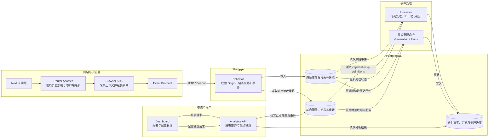

# Web Analytics Platform

为网站提供浏览器端浏览、事件和基础性能统计，并通过 Dashboard 查看和管理。

## 当前状态

MVP 功能已冻结，暂不增加新功能。唯一的未完成与部署待办清单见[功能冻结与部署待办](docs/project-status.md)。功能范围见 [MVP Scope](docs/mvp-scope.md)。

## 核心 Workflow

常规数据流从网站导航开始：Router Adapter 观察导航，Browser SDK 根据 Event Protocol 发送事件；Collector 校验并写入原始事件；Processor 轮询原始事件并生成分析结果；Dashboard 通过 Analytics API 查询结果。站点配置和定义由管理 API 写入，Collector 读取接收策略，Processor 按配置处理事件。显式 rebuild 命令用于重建整站 generation 或指定派生事实。

当前 MVP 包含页面浏览、访客与会话分析、Browser Context、Custom Events、Web Vitals、Conversion/Funnel、country Geo，以及站点 capability 和 ingest policy 配置。完整范围见 [MVP Scope](docs/mvp-scope.md)。

## 开始使用

开发环境和本地运行步骤见 [Getting Started](docs/getting-started.md)。

## 文档入口

- [Documentation Index](docs/README.md)
- [Feature Freeze and Deployment Follow-up](docs/project-status.md)
- [MVP Scope](docs/mvp-scope.md)
- [Getting Started](docs/getting-started.md)
- [Event Protocol](docs/event-protocol.md)

## 开发与验证

项目协作规则见 [AGENTS.md](AGENTS.md)。CI 运行统一的检查、测试、构建、migration、integration 和 E2E workflow。
