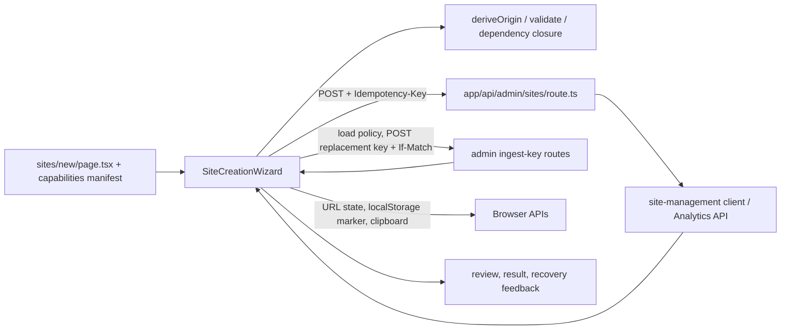
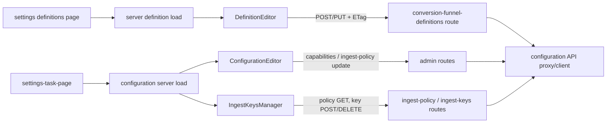
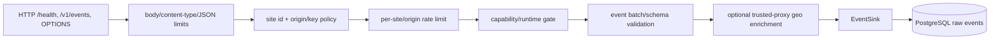
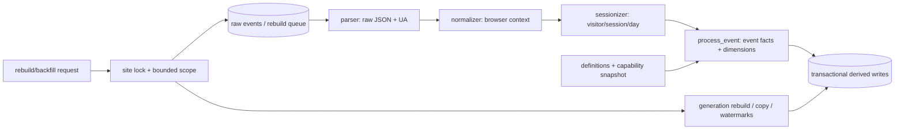
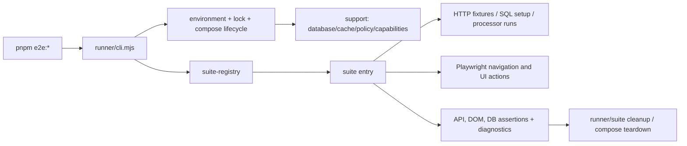

# 代码重构候选的领域依赖和行为边界

本调查对应 [Checklist 1.2](./code-refactoring-checklist.md)。内容依据当前源代码和测试静态追踪，描述现状，不改变实现。没有从文件名推断未展示的运行时行为；无法由静态代码确认的事项标为“待验证”。

## Dashboard：创建站点

入口为 `app/dashboard/sites/new/page.tsx`，服务端读取 capability manifest 并渲染客户端 `SiteCreationWizard`。向导组件目前同时持有表单、步骤、提交幂等信息、创建结果和替换密钥恢复状态；纯计算导出 `deriveOrigin`、`closeCapabilityDependencies`、`siteCreateFieldName`，但 localStorage、fetch、history、clipboard 等副作用仍在组件内。

| 边界           | 当前职责和状态所有者                                                                                                           | 副作用/依赖                                                                         | 相关测试与允许方向                                                                                                                        |
| -------------- | ------------------------------------------------------------------------------------------------------------------------------ | ----------------------------------------------------------------------------------- | ----------------------------------------------------------------------------------------------------------------------------------------- |
| 页面入口       | 传入 manifest；页面本身不持有向导状态                                                                                          | `protocol/capabilities/capabilities.json`                                           | 当前 UI 测试在 `components/site-creation-wizard.ui.test.tsx`；入口只组装组件和静态输入                                                    |
| 向导状态与呈现 | `SiteCreationWizard` 持有字段、step、错误、creating、created/replayed、replacement key/review 状态                             | Next navigation、React、UI primitives、浏览器 API、fetch                            | `site-creation-wizard.test.ts` 覆盖纯 helper；UI lifecycle/retry/恢复覆盖见 UI 测试。依赖应从页面/容器指向领域 helper、API 边界和步骤视图 |
| 创建请求       | `submit` 生成稳定 payload；同 payload 重用 idempotency key；重复提交由 ref guard；200 replay 无法恢复原始 key                  | `POST /api/admin/sites`，API route 经 `lib/site-management/client.ts` 对接后端      | API client 有 `lib/site-management/client.test.ts`；向导 UI 测试覆盖失败/重试和结果状态                                                   |
| 替换 key 恢复  | 页面内明文 key；localStorage 标记表达结果不确定，明确拒绝可清除，网络/5xx 不确定时禁止直接重试；先 GET policy/ETag 再 POST key | `GET/POST .../ingest-policy`、`POST .../ingest-keys`；localStorage；navigator locks | 关键生命周期在 `site-creation-wizard.ui.test.tsx`；未见浏览器多标签真实并发 E2E 专测，待验证                                              |
| 反馈/步骤      | JSX 内联显示字段错误、通用错误、replay/恢复提示、key 一次性说明、安装指引                                                      | `components/ui`                                                                     | 无独立步骤组件；`site-creation-wizard.tsx` 是当前 presenter 和流程控制的共同所有者                                                        |

保持私有的实现是流程状态迁移、payload 组装和存储标记细节；已有可复用接口为三个导出的纯 helper、`SiteCreationWizard({manifest})` 和 admin route/API client。允许依赖方向：page → wizard/container → pure logic/API client/presenter；presenter 不发请求、不访问 storage。创建操作与初始化能力的具体后端事务关系由 route/client 调用链确认，原子性待验证。

## Dashboard：定义、配置和密钥管理

三个领域有相邻的读取类型和错误映射，但远程状态、乐观编辑、版本控制和秘密生命周期不同，不应因共用 `configuration-api` 名称而合并状态所有权。

| 流程     | 状态/逻辑所有者                                                                                                                                                                                         | I/O 与子视图                                                                                                                                         | 测试、公共边界及依赖方向                                                                                                                                                                                                                                                     |
| -------- | ------------------------------------------------------------------------------------------------------------------------------------------------------------------------------------------------------- | ---------------------------------------------------------------------------------------------------------------------------------------------------- | ---------------------------------------------------------------------------------------------------------------------------------------------------------------------------------------------------------------------------------------------------------------------------- |
| 定义管理 | `DefinitionEditor` 外层保留按 siteId 的 saved message；内层 `Editor` 拥有 conversions/funnels、baseline、revision/version、busy/error、冲突和 reload 确认。`PropertyConditions` 是内嵌局部编辑视图。    | `POST` 新定义或 `PUT` 已存在定义，`If-None-Match`/`If-Match`；成功后更新 baseline 并 `router.refresh()`。错误通过 `configurationRequestError` 映射。 | `components/definition-editor.test.tsx`；页面 load/入口见 `app/dashboard/settings/definitions/page.tsx` 和其 page test；revision helper 在 `lib/definition-revision-history.ts`。API 请求由组件直接 fetch，测试需保护并发冲突/未保存变化语义。                               |
| 配置管理 | `ConfigurationEditor` 根据 `ConfigurationLoadResult` 选择 unavailable/missing-capabilities/ready；`InitializeCapabilities` 独立拥有 busy/error；`Editor` 拥有能力/policy 草稿、有效状态版本与保存状态。 | capability initialization POST；配置 capability/policy 更新；`EffectiveStateView`、`ConfigurationErrorFeedback` 呈现状态。                           | `configuration-editor.test.tsx`、`configuration-editor.initialize.ui.test.tsx`；服务端加载在 `lib/configuration-api/server.ts`，类型在 `types.ts`，错误映射在 `errors.ts`。允许 settings page → server load/component → route/proxy/client；纯校验与映射不应依赖 React。     |
| 密钥管理 | `IngestKeysManager` 拥有 policy、one-time secret、busy/error、revoke id、列表刷新需求、review 状态。模块内 runtime guards 校验创建响应和 policy shape。                                                 | fetch policy、创建/撤销 key；Web Locks 协调跨 tab；localStorage 标记未知结果，`storage` event 同步 review；secret 仅保存在内存。                     | `components/ingest-keys-manager.test.tsx` 覆盖创建恢复；routes 为 `app/api/admin/sites/[siteId]/environments/[environment]/ingest-keys/route.ts` 及 `[keyId]/route.ts`。公开组件 props 稳定；schema guard 与交互状态可分离，但 key secrecy/review 不变量需留在同一领域边界。 |

共用边界：`configurationRequestError`、`lib/configuration-api/types.ts`、服务端读取及 dashboard API proxy；admin route/client 的认证、转发与错误转换。专属边界：定义 ETag/版本冲突和 baseline；配置的 effective state 与 capabilities 初始化；key 的明文秘密、互斥、模糊结果恢复。页面或 task-page 负责选 site/environment 并加载数据，组件负责领域草稿和动作，API client/route 负责 I/O；组件不应直接依赖 Rust store。

## Rust：configuration-runtime、Collector 与 Analytics API 配置

### configuration-runtime

`crates/configuration-runtime/src/lib.rs` 是 crate 的实际公开入口，声明 `registry`、`views` 并 re-export `CapabilityId`、registry/error/status 类型、policy/key/definition view；同时目前也实现 `CapabilitySnapshot`、`CapabilitySchemaValidator`、`CapabilityRuntime`。snapshot 校验 schema、site/version 身份、必需 Page Views、实现状态、依赖和 activation window。runtime 从 PostgreSQL 读取并周期刷新配置；刷新间隔为 `REFRESH_INTERVAL`，保留 snapshot 和 stale/applied state 的行为需以具体调用和测试为准。

| 接口/职责                                                     | 依赖与测试                                                                                                              | 允许方向                                                               |
| ------------------------------------------------------------- | ----------------------------------------------------------------------------------------------------------------------- | ---------------------------------------------------------------------- |
| `CapabilitySnapshot::{enabled, enabled_since, from_document}` | protocol capability schema、registry、serde/jsonschema；`lib.rs` 单测含 canonical fixtures、身份/依赖/activation window | schema/领域类型依赖 registry；调用服务依赖公开类型，不暴露 stored row  |
| `CapabilitySchemaValidator::{new, with_registry}`             | canonical `CapabilityRegistry`，include capability schema                                                               | validator 负责 schema + registry 语义校验；runtime 消费 validator      |
| `CapabilityRuntime`                                           | PgPool、锁内 snapshot/应用状态、refresh/task 生命周期；Collector/Processor/API 通过它读取 runtime view                  | 应用通过 runtime API 读配置；DB 查询和刷新实现留 crate 私有            |
| `registry.rs`、`views.rs`                                     | `registry.rs` 有独立测试；views 解析 `EnvironmentPolicyView`、`IngestKeyView`、`DefinitionRevisionView`                 | 纯定义/解析模块不依赖 service handler；保持当前 crate re-export 兼容面 |

实现刷新任务的精确并发/取消保证，以及每种 stale 情况对请求的具体影响，待验证。`lib.rs` 的 `PgPool`/SQL 和 runtime 生命周期是潜在模块切点，不能通过改可见性改变公共 re-export。

### Collector

`collector/src/http.rs::router*` 组装路由和 `AppState`；`events` 处理请求尺寸/JSON/CORS、site/origin/key、限流、capability、校验、geo 和 sink 调用，映射 HTTP 错误。策略数据由 `runtime_policy.rs` 周期读取并报告应用版本；`security.rs` 做 origin/key/environment 匹配，`rate_limit.rs` 独立限流，`validation.rs` 读取 protocol schema/fixtures 并校验事件，`sink.rs` 定义 `EventSink` 并含内存和 PostgreSQL sink；`key.rs` 生成密钥。`config.rs`、`cli.rs`、`main.rs` 是配置/启动边界。

测试分布：HTTP handler 行为在 `services/collector/src/http.rs` 内 tests；policy/security/rate-limit/schema/sink 各模块有自身单测。依赖方向为 HTTP adapter → policy/security/rate limit/runtime/validator/geo/sink；这些领域部件不应反向依赖 Axum handler。sink 接口是注入边界。数据库 sink 的事务原子性与拒绝混合关联事件的精确约束可在 sink tests 定位；HTTP 中策略、限流和验证的确切先后顺序应保留。

### Analytics API configuration

路由声明在 `site_management/routes.rs`，状态在 `state.rs`，授权在 `auth.rs`。配置 handler 位于 `site_management/configuration.rs`：解析 JSON/path/header，检查 `If-Match` 或 `If-None-Match`，用 schema 和依赖/Origin 规则校验，然后调 `config_store.rs` 保存、生成 effective-state projection 和 ETag；`errors.rs` 将 NotFound/Conflict/Validation/Unavailable 映射成统一 API response。`configuration_runtime` 的 view parser 用于读取/验证存储文档；`site_store.rs` 管站点生命周期，`creation.rs` 管创建，`validation.rs` 提供相关管理校验。

| 层                 | 当前边界                                                                                                             | 测试/允许依赖                                                                                  |
| ------------------ | -------------------------------------------------------------------------------------------------------------------- | ---------------------------------------------------------------------------------------------- |
| Route/Auth         | Axum route、AdminAuth 和 `SiteManagementState` 注入                                                                  | site-management HTTP 集成覆盖 `services/analytics-api/tests/http.rs`；route → handler/use case |
| Handler/validation | request DTO、precondition、schema/semantic validation、Origin canonical identity、response/ETag、store error mapping | `configuration.rs` 内 validator tests 含 fixtures/error mapping；不让 HTTP handler 持有 SQL    |
| Store              | `config_store.rs` 的 SQL、版本/冲突处理、审计与运行态应用版本查询                                                    | SQL/事务属于 store 私有职责；被 service 调用，不反向调用 handler                               |
| Runtime views      | 解析已持久化 policy/key/definition 与 capability runtime snapshot                                                    | configuration-runtime 作为 API/Collector/Processor 共享依赖，不反向依赖 service                |

配置更新使用版本条件以避免丢失更新；Origin 唯一约束、定义软停用和 audit 行为由 store/error/test 可定位。事务具体覆盖的 SQL 集合须按 `config_store.rs` 每个操作确认（本调查未把全文件事务细节逐项列出，待验证）。

## Processor

主实现虽集中在 `services/processor/src/processor.rs`，类型依赖已部分分到 `parser.rs`、`normalizer.rs`、`sessionizer.rs`、`models.rs`、`queries.rs`、`definitions.rs`、`capabilities.rs`。入口 `Processor::connect*` 建立 pool、runtime 与 definitions；`process_one/process_all_once` 拉取 raw event，取 capability 快照，再进入处理和写入。rebuild queue 由 `process_rebuild_queue_once` 调度 `rebuild`/`rebuild_inner`；公开 rebuild 方法涵盖转换漏斗、自定义事件、Geo、Web Vitals、站点范围与回滚 generation。

| 阶段             | 数据/状态所有者与副作用                                                                                                            | 相关测试/边界                                                                                                                                                   |
| ---------------- | ---------------------------------------------------------------------------------------------------------------------------------- | --------------------------------------------------------------------------------------------------------------------------------------------------------------- |
| 解析             | `parser.rs` 从 raw payload 解 event 与 UA 基础信息；数据库 raw event 是输入                                                        | `tests/processor.rs` 场景测试、`tests/canonical_fixtures.rs` 合同 fixture；解析不应写库                                                                         |
| 归一化           | `normalizer.rs` 将 browser context 转为稳定字段                                                                                    | module helper 由 processor 调用；协议约束在 fixtures                                                                                                            |
| Sessionization   | `sessionizer.rs` 使用 visitor/time 输入得 session 输出，语义含 inactivity/date 拆分                                                | processor 行为测试保护顺序和身份语义；SessionInput/Output 应保持值对象边界                                                                                      |
| 处理/聚合        | `process_event`、conversion/funnel/custom event/web-vital/geo 事实、dimension daily key/count；definitions + capabilities 控制处理 | `processor.rs` 内部流水线；避免让 parser/sessionizer 依赖 PgPool                                                                                                |
| 普通写入         | `write_derived_results`、`write_dimension_results`、normalized context；PostgreSQL 写入                                            | 对应事务由 SQLx Transaction 参数明确传递；冲突 upsert 和重复 event 的幂等需保留                                                                                 |
| rebuild/backfill | site advisory lock、scope、generation、watermarks、队列项、回滚/旧 generation copy                                                 | `processor.rs` 的 rebuild 函数和 `tests/processor.rs`；测试按页面浏览、session、dimensions、definitions/custom events/Web Vitals/Geo、rebuild/backfill 分组定位 |

当前 transaction 和 advisory site lock 是显式共享不变量；某次 rebuild 对外原子可见范围及 queue 失败重试的确切语义，应逐操作核对并在拆分时由测试固化。公共接口主要是 `Processor` 的 connect/process/rebuild 方法、`RebuildSummary` 和 crate 导出；`RebuildRequest`、`process_event`、SQL helpers 与 dimension tuples 应保持私有。允许方向：输入 parser/normalizer/sessionizer → 纯处理模型 → processor orchestration → SQL/query/store helper；底层纯步骤不反向依赖 orchestration。

## E2E

CLI 入口 `tests/e2e/runner/cli.mjs` 解析 suite 参数，经 `suite-registry.mjs` 选择套件，创建/恢复 `environment.mjs` 状态、加锁和 compose 项目，运行 suite；公共 support 在 `tests/e2e/support/` 提供 compose、DB、cache、capability、ingest policy 工具。Suite 自己目前仍组合环境读取、造数、浏览器动作、API/DB 断言和部分诊断。

| 切片                                         | 现有职责                                                                                    | 主要证据与允许方向                                                                                                                                                                |
| -------------------------------------------- | ------------------------------------------------------------------------------------------- | --------------------------------------------------------------------------------------------------------------------------------------------------------------------------------- |
| Runner/environment                           | suite 选择、锁、环境 fingerprint/state、compose start/reset/down 和命令退出                 | `runner/cli.mjs`、`environment.mjs`、`suite-registry.mjs`；`runner.test.mjs` 测 parser、checkout 绑定和并发锁。runner 可依赖 support/registry，suite 不应管理共享 runner 生命周期 |
| Dashboard suite                              | 页面/设置/定义/密钥/报表展示、造 events/definitions、processor rebuild、API errors 和诊断   | `suites/e2e-dashboard.mjs`；Playwright + fetch/SQL/CLI；fixture `suites/dashboard/fixtures/dashboard-dimensions.json`                                                             |
| Analytics suite                              | protocol fixture 入库、processor 执行、API report 响应和 DB 查询断言                        | `suites/e2e-analytics.mjs`；diagnostics 写入；suite 自持数据期望                                                                                                                  |
| Configuration / site management / onboarding | 配置版本和故障恢复；站点 lifecycle；Dashboard onboarding 错误与 Collector capability 可用性 | `e2e-configuration.mjs`、`e2e-site-management.mjs`、`e2e-site-onboarding.mjs`                                                                                                     |
| 其他 suite                                   | dev startup、router adapters/compose 与环境启动/路由 smoke                                  | 对应 `e2e-dev-startup.mjs`、`e2e-router-adapters.mjs`、`e2e-router-compose.mjs`                                                                                                   |
| Support                                      | compose、DB query、cache、capability/policy setup                                           | `tests/e2e/support/*.mjs`；support 应提供机制，不内嵌某个 suite 的业务断言                                                                                                        |

成功/失败时浏览器关闭、截图/日志和环境清理的统一保障需检查 runner 调用 finally 路径及各 suite 的退出逻辑；目前标记为待验证。允许依赖方向：CLI → runner/environment/support → suite process；suite 可消费 support，不反向导入其他 suite。

## 契约 tooling

命令在根 `package.json`：`protocol:validate` 串行执行 protocol、layout、configuration validators；另有 `capabilities:validate`、`http:validate`、`analytics:contract:validate`、`analytics:definitions:validate`。它们是独立 Node 命令，不共享一个通用 validator 框架；共用模式主要是读取 JSON、AJV schema validator、PASS/error 汇总。语义规则按合同域独立实现。

| 工具                                   | 输入/校验/输出                                                                                                                                      | 测试与共享边界                                                                                                                                         |
| -------------------------------------- | --------------------------------------------------------------------------------------------------------------------------------------------------- | ------------------------------------------------------------------------------------------------------------------------------------------------------ |
| `validate-protocol.mjs`                | protocol event schemas、contexts、valid/invalid fixture；包括 custom properties 和 web vital 等语义规则；输出逐 fixture 诊断与非零退出              | 被 package `protocol:validate` 调用；语义规则是事件合同特有逻辑                                                                                        |
| `validate-contract-layout.mjs`         | 扫描 protocol contract 目录/引用布局；报告缺少或不合法的合同文件布局                                                                                | 与内容语义 validator 不同职责；path scan 可独立测试但当前测试位置需确认                                                                                |
| `validate-configuration-contract.mjs`  | configuration schema/fixtures、capability manifest、OpenAPI；schema + manifest/schema ID/依赖关系/语义案例一致性；PASS/FAIL 汇总                    | package `protocol:validate`；Ajv schema 创建模式重复，但规则域专属                                                                                     |
| `validate-capabilities.mjs`            | capability manifest；ID、状态、依赖图/cycle 规则                                                                                                    | `capabilities:validate`；依赖遍历不可与 HTTP fixture 语义混为一谈                                                                                      |
| `validate-http-fixtures.mjs`           | HTTP ingestion fixtures；fixture shape、headers、setup、scenario/body、response semantics                                                           | `http:validate`；纯 contract fixture 规则                                                                                                              |
| `validate-analytics-api-contract.mjs`  | Analytics API OpenAPI 与协议/查询契约规则；输出诊断                                                                                                 | `analytics:contract:validate`；与 configuration contract 不同文档及 endpoint 语义                                                                      |
| `validate-analytics-definitions.mjs`   | analytics definitions JSON/schema/业务定义约束                                                                                                      | `analytics:definitions:validate`；definitions domain 规则                                                                                              |
| `compare-contract-type-generators.mjs` | JSON schemas 和 canonical samples，执行 pinned generator/toolkit，输出生成源码、逐工具诊断和 `results.json`；`--check/--snapshot` 控制比较/快照行为 | generator/version 比较工具而非 validator；真实共用范围限 JSON 读取、schema validation、diagnostic conventions，外部工具运行与 staging 应保持其自身边界 |

工具共同的 CLI 外围模式（固定 repo root、输入读取、诊断累积、退出码）可后续评估小型 helper；目前没有证据支持共享领域语义规则。依赖方向为 package command → 命令入口 → 合同输入/schema 与对应规则 → stdout/stderr/artifacts；合同规则不依赖其他 validator。

## 大型 HTTP/Processor 测试及 Dashboard CSS

| 候选                                      | 按行为定位的当前分组                                                                                                                                                    | 边界/允许依赖                                                                                                                                                                            |
| ----------------------------------------- | ----------------------------------------------------------------------------------------------------------------------------------------------------------------------- | ---------------------------------------------------------------------------------------------------------------------------------------------------------------------------------------- |
| `services/analytics-api/tests/http.rs`    | site management 创建/读取/更新/删除、配置 capabilities/policy/definitions、auth/precondition/conflict、analytics query/report、空值及错误响应等 HTTP 行为               | 集成测试驱动真实 router + test DB，setup/fixture 可共享；按 router/domain 行为分组而不是抽象通用断言层。具体测试模块边界目前是单文件，分组依据应在后续拆分时以 `#[tokio::test]` 名称复核 |
| `services/collector/src/http.rs` 内 tests | health/content type/body size/JSON、CORS/preflight、origin/key/site policy、rate limit、capability、schema validation、sink 接收/错误响应                               | handler 级行为测试靠近 HTTP adapter；security/limiter/validator/sink 的纯规则优先由各自模块测试                                                                                          |
| `services/processor/tests/processor.rs`   | ingest 到聚合、visitor/session/date、UA/context、capability gate、dimensions、definitions/rebuild/backfill/generation/rollback、重复执行和失败场景                      | 集成 DB 行为集中验证；canonical protocol fixture 另见 `canonical_fixtures.rs`。拆测文件可共用明确 DB fixture，不应把 processor 私有流水线变成 public API                                 |
| `apps/dashboard/styles.css`               | 全局导入入口 `app/layout.tsx`；可识别 dashboard shell/sidebar/header、cards/forms/buttons、tables/reports、settings/task states、site onboarding、responsive media 区域 | Next 全局 CSS 应由根 layout 加载；CSS selector 目前集中在全局文件，组件 class 名是关联点。精确样式区域/重复覆盖与级联顺序应在视觉检查后确认，静态分类待验证                              |

测试的允许依赖方向为测试 → 公共 router/Processor API → 应用模块；共享 test support 只承载建置与 fixture，不承担生产职责。CSS 依赖组件结构和全局 token，组件不应依赖某个测试文件。对测试场景进一步分组时，保留数据库隔离、事务、故障注入和诊断清理行为。

## 排序依据与未决验证

本调查未发现足以推翻 [路线图](./code-refactoring-roadmap.md) 初始候选排序的证据：Dashboard 创建流程仍是有垂直流程、可见状态迁移和现存 UI/helper 测试的完整试点；Rust runtime、Collector/API 配置、Processor 和 E2E 均是后续独立领域边界；测试/CSS 仍需要先确认夹具共享、事务和级联限制。因此候选顺序不变。1.3 验证基线见[验证基线](./code-refactoring-validation-baseline.md)，1.4 具体范围、模块树和验收设计见[创建站点试点设计](./code-refactoring-site-creation-pilot.md)。这些材料完成了静态评审，不表示其中列出的行为已经在运行时验证。

以下动态属性仍须在相应实施工作包中验证：跨标签密钥创建并发、浏览器失败截图/清理 finally 路径、configuration store 每个操作的事务覆盖、Processor rebuild 对外原子可见范围及失败重试，以及全局 CSS 的级联冲突。此文档只将代码中直接可见的接口和调用关系作为事实。
